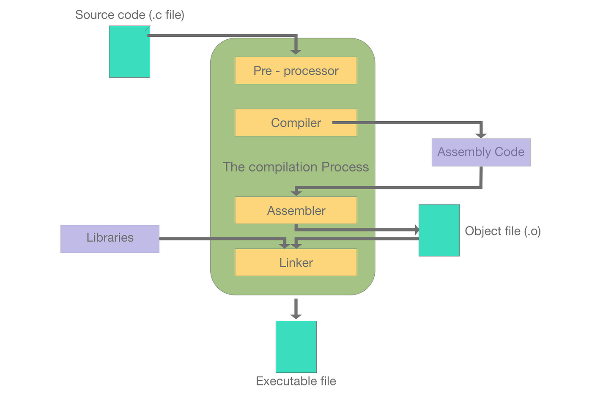

# Compilation process

[](https://medium.com/@joel.dumortier/the-steps-of-compilation-with-gcc-60661f66890e)

# [ELF](https://en.wikipedia.org/wiki/Executable_and_Linkable_Format) file structure
`man elf` has very detailed information. Refer to it when not sure about something.
Source file at `/usr/include/elf.h`

## ELF header (Ehdr)

52 or 64 bytes for 32-bit and 64-bit, always at beginning (offset 0 into the file).

```c
#define EI_NIDENT 16
typedef struct elf64_hdr {
  unsigned char	e_ident[EI_NIDENT];	/* ELF "magic number" */
  Elf64_Half e_type;
  Elf64_Half e_machine;
  Elf64_Word e_version;
  Elf64_Addr e_entry;		/* Entry point virtual address */
  Elf64_Off e_phoff;		/* Program header table file offset */
  Elf64_Off e_shoff;		/* Section header table file offset */
  Elf64_Word e_flags;
  Elf64_Half e_ehsize;
  Elf64_Half e_phentsize;
  Elf64_Half e_phnum;
  Elf64_Half e_shentsize;
  Elf64_Half e_shnum;
  Elf64_Half e_shstrndx;
} Elf64_Ehdr;
```

## Program header = segments (Phdr)

Like `vmmap` in pwndbg. Not for object files since they are intermediate files and not meant to be loaded into execution memory. Use `readelf -l` to view them.
"It is found at file offset `e_phoff`, and consists of `e_phnum` entries, each with size `e_phentsize`." - wikipedia

```c
typedef struct {
    uint32_t   p_type;
    uint32_t   p_flags;
    Elf64_Off  p_offset;
    Elf64_Addr p_vaddr;
    Elf64_Addr p_paddr;
    uint64_t   p_filesz;
    uint64_t   p_memsz;
    uint64_t   p_align;
} Elf64_Phdr;
```

## Section header (Shdr)

Define various things about the ELF. (Note that `sh_name` is offset into `.shstrtab` not index).
Use `readelf -S` to view them. The size is at `readelf -h`.

```c
typedef struct {
    uint32_t   sh_name;
    uint32_t   sh_type;
    uint64_t   sh_flags;
    Elf64_Addr sh_addr;
    Elf64_Off  sh_offset;
    uint64_t   sh_size;
    uint32_t   sh_link;
    uint32_t   sh_info;
    uint64_t   sh_addralign;
    uint64_t   sh_entsize;
} Elf64_Shdr;
```

## Symbol table

```c
typedef struct {
    uint32_t      st_name;
    unsigned char st_info;
    unsigned char st_other;
    uint16_t      st_shndx;
    Elf64_Addr    st_value;
    uint64_t      st_size;
} Elf64_Sym;
```

`st_name` is the offset into `.strtab`. For `SECTION` type the name is from the section name.
`st_value` is the value of the symbol. For `FUNC` and `OBJECT` they are the offset into the section, and the section is in `st_shndx`.
`st_shndx` displays as `Ndx` in `readelf -s`, is the associated section (NOT symbol) index of this symbol. For `SECTION` type symbol it is the index of itself in section headers.
`st_size` is the size of an object (like 4 for int) or func (the machine code length).

## Relocation entries

```c
typedef struct {
    Elf64_Addr r_offset;
    uint64_t   r_info;
} Elf64_Rel;

typedef struct {
    Elf64_Addr r_offset;
    uint64_t   r_info;
    int64_t    r_addend;
} Elf64_Rela;
```

Relocations are for object files when calling another function. The assembler doesn't know the address so leaves a relocation entry.

For example, `.text` section has relocation section `.rela.text` storing an array of `Elf64_Rela`.

* `r_offset` means the offset into the corresponding section (`.text` in this case).
* `r_info` defines type and info. Lower 4 bytes is type, higher 4 bytes is the index of **symbol**.
* `r_addend` add to the address of that symbol.

For `call` in x86,  first byte is `e8` and the rest 4 bytes is the offset of address between target PC and next PC (current+5). Thus, `r_offset` is the offset of the last 4 bytes of the `call` into `.text`, `r_info` points to the target function's index in symbol table, and `r_addend` is `-4` to tradeoff the length of the pointer.

```
  1e:	e8 00 00 00 00       	call   23
  
      Offset             Info             Type               Symbol's Value  Symbol's Name + Addend
000000000000001f  0000000300000004 R_X86_64_PLT32         0000000000000000 zoo - 4
```

For this type, the linker will minus the target address by the current address and then add the addend.

## Runtime

TODO
